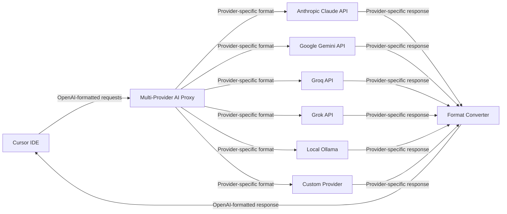
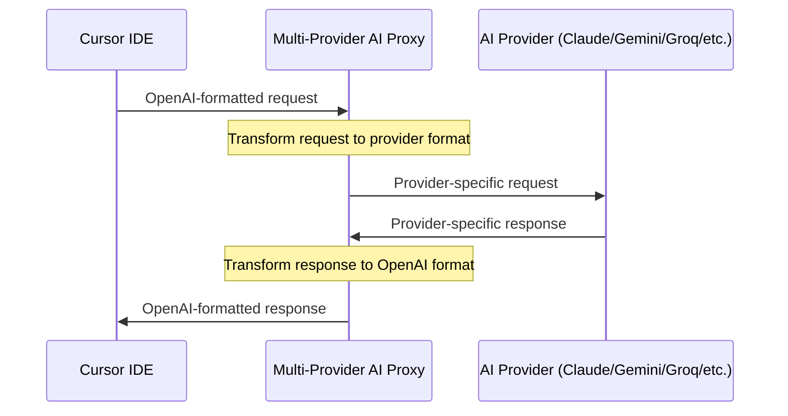
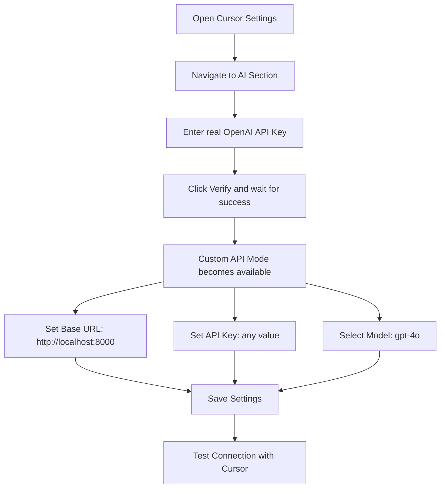
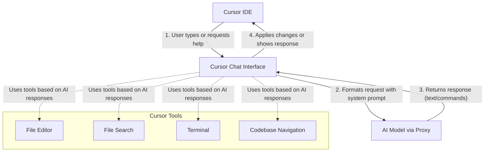

# Multi-Provider AI Proxy for Cursor

A flexible proxy server that enables [Cursor IDE](https://cursor.sh/) to work with various AI providers (Anthropic Claude, Google Gemini, Groq, etc.) while maintaining OpenAI-compatible API formatting.

## Features

- **Multi-Provider Support**: Works with Anthropic Claude, Google Gemini, Groq, local Ollama, and custom providers
- **OpenAI API Compatibility**: Makes any supported AI provider work with Cursor IDE
- **Model Mapping**: Maps OpenAI model names (like gpt-4o) to provider-specific models
- **System Prompt Control**: Customizable system prompts for better control of AI behavior
- **Streaming Support**: Efficient streaming responses for real-time interaction
- **Format Conversion**: Handles format conversion between different API structures
- **Ngrok Integration**: Optional ngrok integration for exposing your local proxy

## How It Works

This proxy acts as a bridge between Cursor IDE (or any OpenAI-compatible client) and various AI providers:



### Request/Response Flow



## Installation

### Prerequisites

- Python 3.8 or higher
- pip for installing dependencies

### Setup

1. Clone the repository:
   ```bash
   git clone https://github.com/yourusername/multi-provider-ai-proxy.git
   cd multi-provider-ai-proxy
   ```

2. Install dependencies:
   ```bash
   pip install -r requirements.txt
   ```

3. Create your configuration file:
   ```bash
   cp .env.template .env
   ```

4. Edit the `.env` file with your provider selection and API keys.

## Configuration

The proxy is highly configurable through environment variables or the `.env` file:

- `AI_PROVIDER`: Select your AI provider (anthropic, google, groq, grok, ollama, custom)
- `*_API_KEY`: API keys for different providers
- Custom model mappings and provider URLs
- Logging and performance settings
- System prompt customization

## Usage

### Running the proxy server

Start the proxy server:

```bash
python multi_ai_proxy.py
```

The server will start on port 5000 by default (configurable through the `PORT` environment variable).

### Configuring Cursor

**IMPORTANT**: Cursor requires verification with a valid OpenAI API key first before you can use custom endpoints.

Here's how to set up Cursor with your proxy:

1. First, enter a **real OpenAI API key** in Cursor's settings (Settings > AI > API Key)
2. Click "Verify" and wait for Cursor to confirm the key works
3. After verification succeeds, Cursor will unlock the "Custom API Mode" option
4. Now you can change the "Base URL" to your proxy URL:
   - Local usage: `http://localhost:8000`
   - Remote usage: Your NGROK URL (e.g., `https://your-unique-id.ngrok.io`)
5. Click "Verify" again to test the connection to your proxy
6. Select your preferred model from the dropdown
7. Start using Cursor with your custom model!

The proxy automatically runs NGROK to create a secure tunnel if enabled in your configuration. This allows you to use your proxy from anywhere or share it with team members.



## Adding Custom Models

You can define custom model mappings in multiple ways:

1. Using the `CUSTOM_MODEL_MAPPINGS` environment variable (JSON format):
   ```
   CUSTOM_MODEL_MAPPINGS={"groq": {"gpt-4o": "llama3-8b-8192", "gpt-3.5-turbo": "mixtral-8x7b-32768"}}
   ```

2. Using individual model override variables:
   ```
   CUSTOM_MODEL_GPT4O=your-best-model
   CUSTOM_MODEL_GPT35=your-fast-model
   ```

3. By directly editing the `MODEL_MAPPINGS` dictionary in the code.

## Importance of System Prompts

System prompts are critical for controlling how the AI model behaves in Cursor. They provide instructions that help the model understand:

1. **How to use Cursor's tools** - Critical for editing files and searching codebases
2. **How to format responses** - Important for consistent code suggestions
3. **Domain-specific instructions** - Can focus the model on specific programming languages or tasks

The default system prompt includes sections for:

- Tool calling behavior
- Code change instructions
- Search and file reading strategies
- Recursion prevention

You can customize these by setting the `CUSTOM_AGENT_INSTRUCTIONS` variable in your `.env` file.

## Cursor Integration Architecture

Cursor interacts with AI models through a specific pattern:



## Troubleshooting

If you encounter issues:

1. Check the proxy logs for errors
2. Verify your API keys are correct in the `.env` file
3. Ensure you've selected a supported provider
4. Check network connectivity to the provider's API endpoints

Common issues:
- Invalid API keys
- Rate limiting from providers
- Incorrect model mappings
- Network connectivity problems

## License

This project is licensed under the MIT License - see the LICENSE file for details.

## Contributing

Contributions are welcome! Please feel free to submit a Pull Request. 